<div align="center">



<br/>

**Fesal Fayed** &nbsp;·&nbsp; Data &amp; ML Engineer &nbsp;·&nbsp; Miami
`agents type, humans steer`

</div>

<br/>

I build **agents** and fine-tune **models**. Most of my time goes into the pipeline above — turning siloed sources into structured signal you can actually act on, with a multi-agent council doing the typing and me doing the steering.

<br/>

### `siloed sources` → what goes in

A **quantified-self pipeline** pulls biometrics (Ultrahuman), iOS context (location, screen time, messages, calendar), training (Hevy), nutrition, and a nightly self-coded journal into one time-series store — then feeds it to ML to answer questions like *"does a late workout plus heavy screen time cost me Tuesday morning?"* Stop guessing the ideal routine; let the machine find the correlations.

### `agentic harness` → what runs

A **multi-profile agentic harness** — orchestrator (chair), builders, analyst — wired through Discord, kanban, and Notion on top of [Hermes](https://huggingface.co/fesalfayed). Agents do the work; the human sets direction. Local-default infra, cloud only on demand, idle GPU fleets meshed over Tailscale when a job needs them.

### `structured signal` → what ships

**hermes function-calling fine-tunes** — `gpt-oss-20b` tuned for tool use, released in four formats so it runs wherever.

| model | format | runs on | downloads |
| :--- | :--- | :--- | ---: |
| [`…finetune_mlx`](https://huggingface.co/fesalfayed/gpt-oss-20b-hermes_agent-tool-finetune_mlx) | mlx | Apple Silicon | 1,120 |
| [`…finetune_gguf`](https://huggingface.co/fesalfayed/gpt-oss-20b-hermes_agent-tool-finetune_gguf) | gguf | llama.cpp · Ollama · LM Studio | 1,006 |
| [`…finetune_4bit`](https://huggingface.co/fesalfayed/gpt-oss-20b-hermes_agent-tool-finetune_4bit) | 4-bit | Colab | 191 |
| [`…finetune_16bit`](https://huggingface.co/fesalfayed/gpt-oss-20b-hermes_agent-tool-finetune_16bit) | 16-bit | vLLM | 89 |

> **2,400+ downloads** · evals coming soon · [collection →](https://huggingface.co/collections/fesalfayed/finetuned-hermes-function-calling-v1)

<br/>

### `principles`

```
fix the root, not the symptom    ·    local default, cloud on demand
agents type, humans steer        ·    one project, one repo, one job
```

### `stack`

**ml** pytorch · dspy · vllm · llama.cpp · mlx · lm-eval-harness · w&b
**agents** hermes · mcp · discord · notion workers sdk
**daily** python · typescript · bash · docker · tailscale

<br/>

<div align="center">

[**hi@fesalfayed.com**](mailto:hi@fesalfayed.com) &nbsp;·&nbsp; [huggingface.co/fesalfayed](https://huggingface.co/fesalfayed) &nbsp;·&nbsp; [fesalfayed.com](https://fesalfayed.com)

<sub>B.S. Data Science &amp; Artificial Intelligence — Florida International University</sub>

</div>
