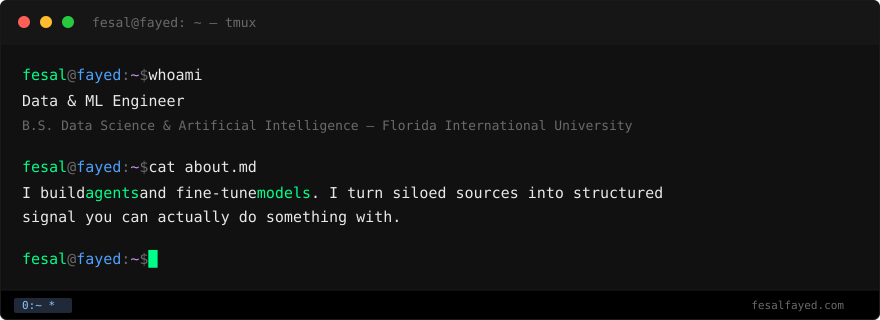

<div align="center">
  
</div>

<br/>

```console
fesal@fayed:~$ cd projects/ && ls -la
```

| dir | what | status |
| :--- | :--- | :--- |
| **viml.ai/** | vertical intelligence layer | `stealth` |
| **qs/** | quantified-self pipeline — biometrics + iOS + training + journal → one store, fed to ML | building |
| **ambler/** | idle GPU fleets → multi-cluster nodes over a tailscale mesh | infra |
| **agentic-os/** | multi-profile agent council wired through Discord, kanban, Notion | meta |
| **fine-tuning/** | gpt-oss-20b tuned for tool use, four formats | shipped |

<br/>

```console
fesal@fayed:~$ cat fine-tuning/README.md
```

**hermes function-calling fine-tunes** — `gpt-oss-20b` tuned for tool use, released in four formats so it runs wherever: mlx for Apple Silicon, gguf for llama.cpp/Ollama/LM Studio, 4-bit for Colab, 16-bit for vLLM.

| model | format | downloads |
| :--- | :--- | ---: |
| [gpt-oss-20b-hermes_agent-tool-finetune_mlx](https://huggingface.co/fesalfayed/gpt-oss-20b-hermes_agent-tool-finetune_mlx) | mlx | 1,120 |
| [gpt-oss-20b-hermes_agent-tool-finetune_gguf](https://huggingface.co/fesalfayed/gpt-oss-20b-hermes_agent-tool-finetune_gguf) | gguf | 1,006 |
| [gpt-oss-20b-hermes_agent-tool-finetune_4bit](https://huggingface.co/fesalfayed/gpt-oss-20b-hermes_agent-tool-finetune_4bit) | 4-bit | 191 |
| [gpt-oss-20b-hermes_agent-tool-finetune_16bit](https://huggingface.co/fesalfayed/gpt-oss-20b-hermes_agent-tool-finetune_16bit) | 16-bit | 89 |

> `# 2,400+ total downloads · evals coming soon`
> [collection →](https://huggingface.co/collections/fesalfayed/finetuned-hermes-function-calling-v1)

<br/>

```console
fesal@fayed:~$ cat .principles
```

```
•  fix the root, not the symptom
•  local default, cloud on demand
•  agents type, humans steer
•  one project, one repo, one job
```

<br/>

```console
fesal@fayed:~$ ls stack/
```

`llms` → pytorch · dspy · vllm · llama.cpp · mlx · lm-eval-harness · w&b
`agents` → hermes · mcp · discord · notion workers sdk
`daily` → python · typescript · bash · docker · tailscale

<br/>

```console
fesal@fayed:~$ ls contact/
```

[`hi@fesalfayed.com`](mailto:hi@fesalfayed.com) · [`huggingface.co/fesalfayed`](https://huggingface.co/fesalfayed) · [`fesalfayed.com`](https://fesalfayed.com)
