<div align="center">



# Fesal Fayed

#### Data &amp; ML Engineer &nbsp;·&nbsp; Agentic Systems &nbsp;·&nbsp; Tool-Use Fine-Tuning &nbsp;·&nbsp; Applied ML

</div>

I build agentic infrastructure and ship the models that run on it — fine-tuning for tool use, fixing where agent systems break in production-shaped edge cases, and writing the workflow glue that lets agents affect the real world without taking the wheel from the human.

My contributed fixes have landed in the Hermes agent ecosystem; my fine-tuned `gpt-oss-20b` tool-use models ship in four runtimes and are downloaded across the Hugging Face community.

```text
role       Data & ML Engineer
focus      agent infra · fine-tuning · adapter correctness · context
shipped    gpt-oss-20b tool-use finetune — MLX · GGUF · 4-bit · 16-bit
adoption   9k+ Hugging Face downloads
oss        merged fixes in repos totaling 205k+ stars
based      Miami · B.S. Data Science & AI, FIU
```

---

## Proof of work

- **Model shipping** — fine-tuned `gpt-oss-20b` for Hermes-style tool use; released MLX, GGUF, 4-bit, and 16-bit artifacts
- **Adoption** — 9k+ Hugging Face downloads across formats
- **OSS reach** — merged fixes into repositories totaling **205k+ stars** ([`hermes-agent`](https://github.com/NousResearch/hermes-agent) · [`hermes-lcm`](https://github.com/stephenschoettler/hermes-lcm))
- **OSS** — two `NousResearch/hermes-agent` fixes accepted by Teknium: [Anthropic signed-thinking replay](https://github.com/NousResearch/hermes-agent/commit/64628ea89b1d5624f47b402edd54b13afd335123) and [WhatsApp LID alias resolution](https://github.com/NousResearch/hermes-agent/commit/263ffec1b03114ec98671919943fb61de7ebf1bf)
- **Systems** — Discord ↔ Notion worker sync, multi-profile agent harness, local-first automation
- **Applied DS** — Amazon image-quality + product-rank (BSR) modeling case study

---

## Fine-tuning

`gpt-oss-20b` tuned for Hermes-style function calling, shipped in four formats — Apple Silicon, llama.cpp/Ollama, Colab, and vLLM.

| model | format | runs on |
| :--- | :--- | :--- |
| [`finetune_mlx`](https://huggingface.co/fesalfayed/gpt-oss-20b-hermes_agent-tool-finetune_mlx) | MLX | Apple Silicon |
| [`finetune_gguf`](https://huggingface.co/fesalfayed/gpt-oss-20b-hermes_agent-tool-finetune_gguf) | GGUF | llama.cpp · Ollama · LM Studio |
| [`finetune_4bit`](https://huggingface.co/fesalfayed/gpt-oss-20b-hermes_agent-tool-finetune_4bit) | 4-bit | Colab · low-VRAM |
| [`finetune_16bit`](https://huggingface.co/fesalfayed/gpt-oss-20b-hermes_agent-tool-finetune_16bit) | 16-bit | vLLM · full precision |

[the collection →](https://huggingface.co/collections/fesalfayed/finetuned-hermes-function-calling-v1) &nbsp;·&nbsp; [repo notes →](https://github.com/fesalfayed/gpt-oss-20b-hermes-tool-finetune)

---

## Open source

Merged fixes into the Hermes agent ecosystem — repositories totaling **205k+ stars**. My contributions target where agent systems fail in production-shaped edge cases: provider adapters, signed reasoning blocks, tool-use replay, and context assembly.

- **[`hermes-agent`](https://github.com/NousResearch/hermes-agent/pull/35859) — Anthropic extended-thinking crash loop**  
  Authored the fix for crashes when orphan tool-use stripping invalidated signed reasoning blocks. Teknium cherry-picked it to `main` with authorship preserved. [`64628ea`](https://github.com/NousResearch/hermes-agent/commit/64628ea89b1d5624f47b402edd54b13afd335123) · closes [#35847](https://github.com/NousResearch/hermes-agent/issues/35847)

- **[`hermes-agent`](https://github.com/NousResearch/hermes-agent/pull/54083) — WhatsApp LID alias resolution**  
  Authored the session-path fix so modern `platforms/whatsapp/session` installs stop silently dropping allowlisted senders. Accepted with authorship preserved. [`263ffec`](https://github.com/NousResearch/hermes-agent/commit/263ffec1b03114ec98671919943fb61de7ebf1bf) · closes [#36664](https://github.com/NousResearch/hermes-agent/issues/36664)

- **[`hermes-agent`](https://github.com/NousResearch/hermes-agent/issues/35975) — interleaved-thinking signature crash loop**  
  Filed and root-caused; maintainers confirmed the order-preserving channel on `main` solved it without demoting reasoning.

- **[`hermes-agent`](https://github.com/NousResearch/hermes-agent/pull/52276) — leading-assistant transcript backstop**  
  Maintains an adapter-level backstop PR for post-compaction transcripts, complementing the built-in compressor fix for [#52160](https://github.com/NousResearch/hermes-agent/issues/52160) / [#52167](https://github.com/NousResearch/hermes-agent/pull/52167).

- **[`hermes-lcm`](https://github.com/stephenschoettler/hermes-lcm/pull/280) — DAG context role invariant**  
  Merged fix so DAG context summaries cannot become provider-visible leading assistant messages.

More detail: [`oss-contributions`](https://github.com/fesalfayed/oss-contributions).

---

## Selected work

- **[`gpt-oss-20b-hermes-tool-finetune`](https://github.com/fesalfayed/gpt-oss-20b-hermes-tool-finetune)** — end-to-end tool-use fine-tuning notes, export matrix, local inference packaging
- **[`hermes-Notion-Worker-sync`](https://github.com/fesalfayed/hermes-Notion-Worker-sync)** — production-shaped Discord ↔ Notion worker sync on `@notionhq/workers`
- **[`amazon-image-quality-bsr-analysis`](https://github.com/fesalfayed/amazon-image-quality-bsr-analysis)** — applied DS: image-quality metrics, pricing/review enrichment, BSR modeling
- **[`fesalfayed.com`](https://github.com/fesalfayed/fesalfayed-com)** — personal site and public identity surface

---

## Principles

```text
build the infra first          ·   glue siloed sources
humans design, agents scaffold ·   see the elephant, not the tail
```

<div align="center">

[hi@fesalfayed.com](mailto:hi@fesalfayed.com) &nbsp;·&nbsp; [huggingface.co/fesalfayed](https://huggingface.co/fesalfayed) &nbsp;·&nbsp; [fesalfayed.com](https://fesalfayed.com)

<sub>Data &amp; ML Engineer &middot; Miami &middot; B.S. Data Science &amp; AI, FIU</sub>

</div>
